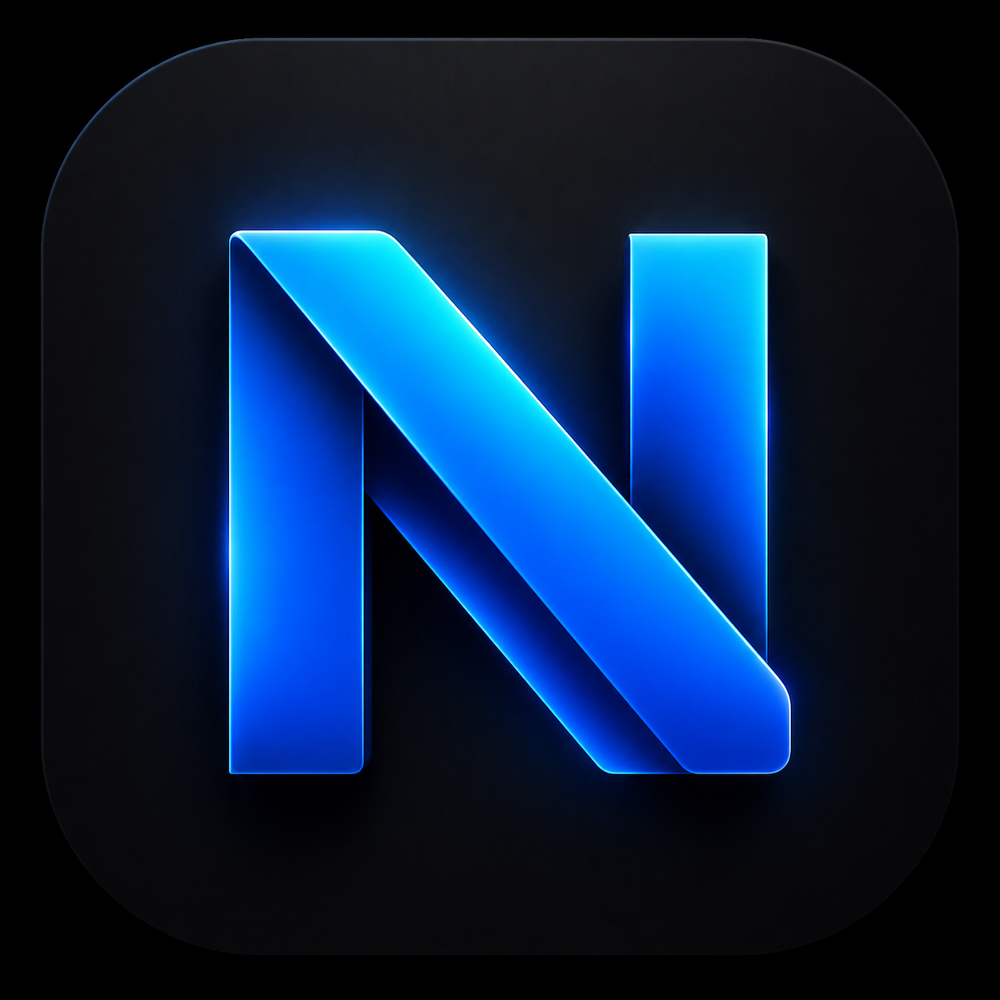

<p align="center">
  
</p>

# nudge

**The reminder you can't ignore.** · [nudgebuddy.net](https://nudgebuddy.net)

Nudge is a self-hosted AI assistant that texts you on iMessage. Tell it what's due, and it'll hound you until you do it — built for people with real ADHD and GSU students trying to snipe open course seats.

---

## What it does

You text it like a friend. It handles the rest.

```
You:   i have a bio exam friday at 8am
Nudge: bio exam friday 8am — want me to really nag you on this one?
You:   yes lol
Nudge: locked in. blowing your phone up thursday. you asked for this
```

When reminder time hits, Nudge texts you. If you don't reply, it escalates — 5 texts, progressively more unhinged. Stops the moment you respond.

---

## Features

- **iMessage native** — shows up where your friends do. Blue bubbles, typing indicators, the whole thing.
- **Persistent nag mode** — escalating texts, 30 seconds apart. Stops when you reply.
- **Natural language** — "remind me to submit my essay tomorrow at noon" just works.
- **One-off reminders** — "remind me to take my meds in 20 minutes" works too.
- **Multiple personas** — Coach, Snarky, or Anxious. Pick your vibe.
- **Web dashboard** — see your assignments, pick your persona, mark things done.
- **OTP login** — sign in via a code Nudge texts you. No passwords.
- **Location reminders** — "nag me when I get home to take out the trash." Uses iOS Shortcuts + geofencing. No app needed.
- **SeatSnipe** — monitors GSU Banner for open course seats and texts you the instant one opens. Polling every 60–90s during surge mode.

---

## SeatSnipe

Built for GSU students during add/drop. Text a course name or CRN, and Nudge watches Banner 24/7 until a seat opens.

```
You:   watch CSC 1301
Nudge: Found 3 sections for CSC 1301 — reply with a number:
       1. Sec 002, MW 11:00–12:15, Saghaeiannejad (40 seats open)
       2. Sec 005, TR 2:00–3:15, Williams (full)
       3. Sec 008, Online Async, Johnson (full)
You:   3
Nudge: Watching CSC 1301 Sec 008 (CRN 12345). I'll text you the second a seat opens.

[3 hours later]
Nudge: 🚨 A seat just opened in CSC 1301 Sec 008 — go register NOW before it's gone
```

- Polls Banner every 60–90s in surge mode, 5min normal
- Alerts fire only on 0→seat transitions (not flapping)
- 10-min cooldown + 6/day cap per watch to prevent spam
- Up to 5 active watches per user
- Watches auto-expire when add/drop closes

---

## Tech stack

| Layer | Tech |
|---|---|
| Frontend / API | Next.js 14 (App Router), Vercel |
| Database | Neon (serverless Postgres) + Prisma |
| Job queue | BullMQ + Upstash Redis |
| iMessage bridge | BlueBubbles |
| AI | Anthropic API |
| Auth | JWT via jose |
| Worker | Node.js + PM2 (persistent process) |
| Banner API | Custom TypeScript client with session cookie management |

---

## Architecture

```
iMessage → BlueBubbles → Webhook → Next.js API (Vercel)
                                         ↓
                                    AI Agent Loop
                                         ↓
                               BullMQ (Upstash Redis)
                                         ↓
                              Worker (PM2, persistent)
                             /                       \
                    Reminder jobs              SeatSnipe watcher loop
                                                      ↓
                                             Banner API polling
                                                      ↓
                                              Alert → iMessage
```

The worker is a persistent Node.js process managed by PM2. It runs the BullMQ consumer and the SeatSnipe polling loop in the same event loop — no separate process needed.

---

## Requirements

- A Mac (always-on) running [BlueBubbles](https://bluebubbles.app) with an Apple ID
- SIP disabled + BlueBubbles Private API enabled (for typing indicators)
- Node.js 22+
- [Neon](https://neon.tech) account (Postgres)
- [Upstash](https://upstash.com) account (Redis)
- Anthropic API key

---

## Setup

### 1. Clone and install

```bash
git clone https://github.com/Skirozik/nudge.git
cd nudge
npm install
```

### 2. Configure environment

```env
# Database (Neon)
DATABASE_URL=postgresql://...

# Redis (Upstash)
REDIS_URL=rediss://...

# BlueBubbles (your Mac's local IP or tunnel URL)
BLUEBUBBLES_URL=http://192.168.1.x:1234
BLUEBUBBLES_PASSWORD=your_password
BLUEBUBBLES_METHOD=private-api

# Webhook security
WEBHOOK_SECRET=generate_a_random_string_here

# AI
ANTHROPIC_API_KEY=sk-ant-...

# Session signing
SESSION_SECRET=generate_another_random_string_here

# App URL (used for location reminder webhook URLs)
NEXT_PUBLIC_APP_URL=https://yourdomain.com

# Admin iMessage address (for admin commands: stats, surge on/off, broadcast)
ADMIN_PHONE=+1XXXXXXXXXX

# SeatSnipe: date to expire all watches (GSU add/drop end)
TERM_WATCH_END=2026-08-28
```

### 3. Run migrations

```bash
npx prisma migrate deploy
npx prisma generate
```

### 4. Deploy

- **Frontend/API**: Deploy to Vercel. Add all env vars in the Vercel dashboard.
- **Worker**: Run on any always-on machine with PM2:

```bash
pm2 start ecosystem.config.cjs
pm2 save
```

### 5. Configure BlueBubbles

In BlueBubbles Settings → API → Webhooks, add:

```
https://yourdomain.com/api/webhook/bluebubbles?secret=YOUR_WEBHOOK_SECRET
```

Enable **All Events**.

---

## Project structure

```
nudge/
├── prisma/
│   ├── schema.prisma              # User, Assignment, Watch, LocationReminder, etc.
│   └── migrations/
├── src/
│   ├── app/
│   │   ├── page.tsx               # Landing page
│   │   ├── login/                 # OTP login flow
│   │   ├── dashboard/             # User dashboard
│   │   └── api/
│   │       ├── webhook/           # BlueBubbles inbound webhook
│   │       ├── auth/              # send-otp, verify-otp, logout
│   │       ├── dashboard/         # Assignments + user REST API
│   │       └── location-trigger/  # iOS Shortcuts location webhook
│   ├── lib/
│   │   ├── agent.ts               # AI agent loop + tool execution
│   │   ├── banner.ts              # GSU Banner API client (seat data)
│   │   ├── bluebubbles.ts         # iMessage send + typing indicator
│   │   ├── locationToken.ts       # Per-user webhook token provisioning
│   │   ├── phone.ts               # Phone number normalization
│   │   ├── queue.ts               # BullMQ job scheduling
│   │   ├── session.ts             # JWT auth helpers
│   │   ├── timezone.ts            # Timezone resolution
│   │   ├── watcher.ts             # SeatSnipe polling loop
│   │   └── watches.ts             # Watch CRUD + diff logic
│   ├── worker/
│   │   └── index.ts               # BullMQ worker + SeatSnipe watcher entry
│   └── middleware.ts              # Route protection
├── ecosystem.config.cjs           # PM2 config
└── vitest.config.ts               # Unit tests (Vitest)
```

---

## Admin commands

Text these from `ADMIN_PHONE`:

| Command | What it does |
|---|---|
| `stats` | Active users, watches, 24h alerts, total seats caught |
| `surge on` | Switch SeatSnipe to 60–90s polling |
| `surge off` | Return to 5-min polling |
| `broadcast <msg>` | Send a message to all opted-in users |

---

## Personas

| Persona | Vibe |
|---|---|
| **Coach** | Warm, supportive, gets things done |
| **Snarky** | Dry humor, calls you out, still shows up |
| **Anxious** | Stressed on your behalf, endearingly flustered |

Change yours anytime in the dashboard or just tell Nudge.

---

## Notes

- Never run two worker processes simultaneously — duplicate sends will happen.
- After `prisma generate`, fully restart the worker — hot reload doesn't pick up client changes.
- BlueBubbles webhook may need to be re-saved in Settings after server downtime.
- Add Nudge to your Do Not Disturb allowed contacts so reminders get through in focus mode.

---

## License

MIT
